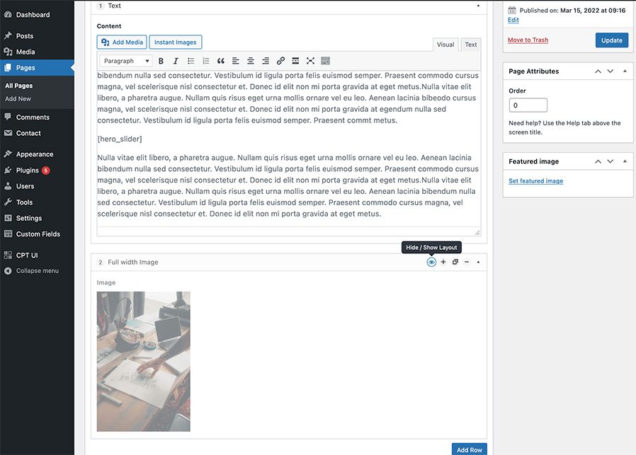

<!-- PROJECT LOGO -->
 

	
  	<h3 align="center">Hide ACF Layout</h3>
 	 

    	Hide a module in ACF flexible content on the frontend but still keep it in the backend
   		 
 	 

<!-- ABOUT THE PROJECT -->
## About The Project
If you want to test what a layout would look like or not ready to go live with a module. Press the hide icon and it will be hidden to anyone not logged in to WordPress but you can still preview the content.

 
 

	</img>

 
 
 

<!-- Installation -->
## Installation
1. Upload the plugin files to the `/wp-content/plugins/` directory, or install the plugin through the WordPress plugins screen directly.
2. Activate the plugin through the 'Plugins' screen in WordPress.

 
 

<!-- FAQ -->
## How to use it?
Next to the flexible content options "Add Layout" and "Remove Layout" is a new option "Hide / Show Layout".
Toggling that option will hide or show the layout on the fronted.

 
 

<!-- USAGE EXAMPLES -->
## Usage

The ACF Hide Layout settings will show under "Tools" if on localhost.

 
 
 

<!-- CONTACT -->
## Contact
Luke Ketchen - [lukeketchen.com](http://lukeketchen.com/)
 
Project Link: [github.com/Ketch-Labs/hide-acf-layout](https://github.com/Ketch-Labs/hide-acf-layout)

 
 
 

<!-- ACKNOWLEDGMENTS -->
## Acknowledgments
[Hiding icons created by Freepik - Flaticon](https://www.flaticon.com/free-icons/hiding)

(<a href="#top">back to top</a>)

